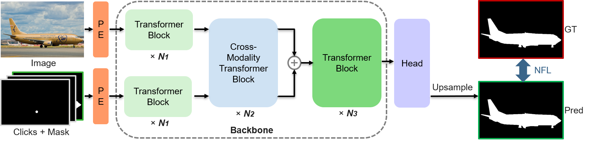

# iCMFormer
A click-based interactive image segmentation method with cross-modality transformers.

This is the official implementation of the paper "Interactive Image Segmentation with Cross-Modality Vision Transformers".

### <p align="center"> Interactive Image Segmentation with Cross-Modality Vision Transformers
<br>

<div align="center">
  Kun&nbsp;Li</a> <b>&middot;</b>
  George&nbsp;Vosselman</a> <b>&middot;</b>
  Michael Ying&nbsp;Yang</a>
  <br> <br>
  <a href="https://openaccess.thecvf.com/content/ICCV2023W/NIVT/html/Li_Interactive_Image_Segmentation_with_Cross-Modality_Vision_Transformers_ICCVW_2023_paper.html" target="_blank">Paper</a>
</div>
</br>

<div align=center></div>

### Abstract

Interactive image segmentation aims to segment the target from the background with the manual guidance, which takes as input multimodal data such as images, clicks, scribbles, polygons, and bounding boxes. Recently, vision transformers have achieved a great success in several downstream visual tasks, and a few efforts have been made to bring this powerful architecture to interactive segmentation task. However, the previous works neglect the relations between two modalities and directly mock the way of processing purely visual information with self-attentions. In this paper, we propose a simple yet effective network for click-based interactive segmentation with cross-modality vision transformers. Cross-modality transformers exploit mutual information to better guide the learning process. The experiments on several benchmarks show that the proposed method achieves superior performance in comparison to the previous state-of-the-art models. In addition, the stability of our method in term of avoiding failure cases shows its potential to be a practical annotation tool.

### Preparations

PyTorch 1.10.2, Ubuntu 16.4, CUDA 11.3.

```
pip3 install -r requirements.txt
```

### Download

The datasets for training and validation can be downloaded by following: [RITM Github](https://github.com/saic-vul/ritm_interactive_segmentation)

The pre-trained models are coming soon.

### Evaluation

Before evaluation, please download the datasets and models and configure the path in configs.yml.

The following script will start validation with the default hyperparameters:

```
python scripts/evaluate_model.py NoBRS \
--gpu=0 \
--checkpoint=./weights/icmformer_cocolvis_vit_base.pth \
--eval-mode=cvpr \
--datasets=GrabCut,Berkeley,DAVIS,SBD
```

### Training

Before training, please download the pre-trained weights (click to download: [ViT](https://github.com/facebookresearch/mae) and [Swin](https://github.com/microsoft/Swin-Transformer)).

Use the following code to train a base model on coco+lvis dataset:

```
python train.py ./models/iter_mask/icmformer_plainvit_base448_cocolvis_itermask.py \
--batch-size=24 \
--ngpus=2
```


## Citation
If iCMFormer is helpful for your research, we'd appreciate it if you could cite this paper.
~~~bibtex
@InProceedings{Li_2023_ICCV,
    author    = {Li, Kun and Vosselman, George and Yang, Michael Ying},
    title     = {Interactive Image Segmentation with Cross-Modality Vision Transformers},
    booktitle = {Proceedings of the IEEE/CVF International Conference on Computer Vision (ICCV) Workshops},
    month     = {October},
    year      = {2023},
    pages     = {762-772}
}
~~~


## Acknowledgement
Here, we thank so much for these great works:  [RITM](https://github.com/SamsungLabs/ritm_interactive_segmentation) and [SimpleClick](https://github.com/uncbiag/SimpleClick)
